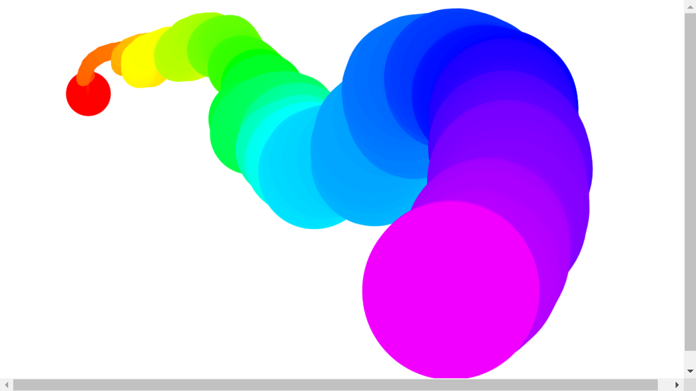

# JS-30-DAY-8

**
Fun with HTML5 Canvas
**

##Lessons Learned:

- learned how to use HTML5 Canvas
- learned use of [`hsl()`](https://mothereffinghsl.com/)
- used `eventListeners()` like `mousemove` `mouseup` `mousedown` `mouseout`
